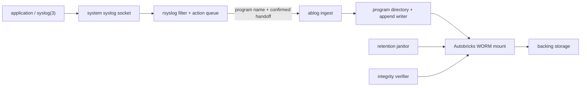
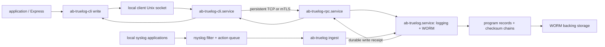

# Autobricks Log and Autobricks True Log

This repository distributes **Autobricks Log** and **Autobricks True Log**. Both use [Autobricks WORM](https://github.com/pregene/autobricks-worm) to protect retained log data. They have different packages, commands, services, and installation procedures.

## Autobricks Log

Autobricks Log collects selected local syslog messages through rsyslog. It separates messages by program, maintains daily files, verifies file integrity, and removes files after their retention period expires.

- Package: `autobricks-log`
- Command: `ablog`
- Services: `ab-worm.service` and `autobricks-log.service`
- Daily files: `<mount>/<program>/ablog-YYYY-MM-DD.log`

### Architecture

- Applications use the standard syslog API.
- rsyslog receives, filters, queues, and forwards selected messages.
- Autobricks Log validates program names, manages daily files, and confirms writes after the configured durability boundary.
- Autobricks WORM enforces append-only storage and retention deadlines.
- The retention janitor requests deletion of expired managed files; WORM remains the final authority.
- The integrity verifier checks retained files.

### Installation and usage

**Log users:**

1. [Install Autobricks Log](INSTALL.md).
2. [Configure rsyslog and send messages](HOWTO.md).
3. [Verify stored files](HOWTO.md#verify-the-file).

These guides apply to **Autobricks Log 0.2.31**. Log users can continue to follow them without switching to True Log.

## Autobricks True Log

Autobricks True Log maintains continuous checksum chains and returns a write receipt containing the filename, size, and checksum before and after each accepted write. Applications can associate those receipts with their business event IDs.

- Server package: `autobricks-truelog`
- Server command: `ab-truelog`
- Storage and logging service: `ab-truelog.service`
- Optional remote gateway: `ab-truelog-rpc.service`, using TCP or mTLS
- Client package and command: `autobricks-truelog-cli` and `ab-truelog-cli`
- Client service: `ab-truelog-cli.service`
- New daily files: `<mount>/<program>/truelog-YYYY-MM-DD.log`

### Architecture

- The client daemon manages the remote connection and enrolled certificates.
- RPC accepts network requests and forwards them to the local storage service.
- The integrated server service manages WORM and logging together.
- True Log owns rotation, chain state, and before/after write receipts.
- Local syslog ingestion remains available through rsyslog.
- A successful client write returns the storage engine's receipt after the configured durability boundary.

### Installation and usage

**True Log users:**

1. [Install the server](TRUELOG.md#install-the-true-log-server).
2. For remote application writes, [install the client](TRUELOG.md#install-the-true-log-client).
3. [Write records and use receipts](TRUELOG.md#write-records-through-the-client).
4. For Express, [configure the runtime account and Node.js integration](TRUELOG.md#express-and-nodejs-integration).
5. For local syslog applications, use [True Log's rsyslog configuration](TRUELOG.md#local-syslog-integration).
6. [Inspect and verify chains on the server](TRUELOG.md#server-side-chain-inspection).

[TRUELOG.md](TRUELOG.md) is the complete installation and operating guide for **True Log 0.3.55**, including pairing recovery and troubleshooting.

## Choose the correct guide

| What you run | Installation | Usage |
| --- | --- | --- |
| `autobricks-log` / `ablog` | [Log installation](INSTALL.md) | [Log usage](HOWTO.md) |
| `autobricks-truelog` / `ab-truelog` | [True Log server](TRUELOG.md#install-the-true-log-server) | [Local syslog](TRUELOG.md#local-syslog-integration) · [Chain inspection](TRUELOG.md#server-side-chain-inspection) |
| `autobricks-truelog-cli` / `ab-truelog-cli` | [True Log client](TRUELOG.md#install-the-true-log-client) | [Remote writes](TRUELOG.md#write-records-through-the-client) · [Express](TRUELOG.md#express-and-nodejs-integration) |

Moving from Log to True Log requires reviewing the [transition guidance](TRUELOG.md#transition-from-autobricks-log). Their package names differ, and installing one over the other is not a routine same-package upgrade.

## Storage and retention

Both products use one SOURCE path and one retention period selected during installation. Applications cannot choose arbitrary storage paths, overwrite committed data through the WORM interface, or delete files before retention expires.

WORM protects the mounted interface. It does not prevent a privileged administrator from directly altering the backing storage or operating system. Retention cleanup removes expired log bytes; retained history cannot reconstruct deleted content.

## Downloads

Download the package for your product, Ubuntu release, and CPU architecture:

- [Autobricks Log 0.2.31](https://github.com/pregene/autobricks-log/releases/tag/v0.2.31)
- [Autobricks True Log 0.3.55](https://github.com/pregene/autobricks-log/releases/tag/v0.3.55)

## License

See [LICENSE](LICENSE) and [THIRD_PARTY_NOTICES.md](THIRD_PARTY_NOTICES.md).
