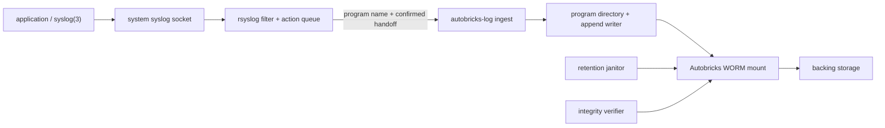

# Autobricks Log

Autobricks Log is an audit-oriented logging service built on the
[Autobricks WORM filesystem](https://github.com/pregene/autobricks-worm).

The service accepts local syslog messages, separates them by program name,
protects stored bytes against modification, and removes expired files according
to the system-wide retention period selected during installation.

## Goals

- Accept messages from applications through the standard system syslog API.
- Create and manage one directory for each syslog program name.
- Create one `ablog-YYYY-MM-DD.log` file per program and local calendar day.
- Make committed bytes append-only through the WORM storage layer.
- Verify file integrity and retain files for a fixed period.
- Delete expired files without giving producers deletion permission.
- Continue safely across process restarts and partial failures.
- Keep credentials and machine-specific data out of the repository.

This project is not intended to replace a general-purpose observability stack,
provide full-text search, or accept arbitrary client-selected paths.

## Architecture



- Applications use the normal `syslog(3)` interface and require no
  Autobricks-specific logging library.
- rsyslog owns system-log reception, filtering, buffering, and delivery.
- Autobricks Log owns program-name validation, file creation, durable writes, and the
  success or failure response returned to rsyslog.
- Autobricks WORM owns append-only enforcement, integrity metadata, and the
  rule that a file cannot be deleted before its retention deadline.
- A janitor enumerates only managed files and requests deletion after expiry.
  The WORM layer remains the final authority.
- Applications cannot select a storage path, change the system-wide retention,
  or delete files.

The inherited filesystem documentation is retained in
[docs/WORM_README.md](docs/WORM_README.md).

Autobricks Log installs one executable named `ablog`. Its service and operator
functions are selected with subcommands:

```text
ablog mount ...
ablog unmount ...
ablog ingest PROGRAM
ablog daemon
ablog check
ablog verify PROGRAM
```

The Debian package does not install separate ingest, daemon, control, or WORM
executables.

## Version policy

Development started at version `0.2.8`. Increase the patch component after
every successful official build or test run. A failed build or failed test does
not change the version. `./build.sh` performs the successful-build increment
automatically. `./test.sh --locked` runs the Autobricks Log test target and
applies the same rule after a successful test run. The inherited WORM project's
own regression tests remain separate from the Autobricks Log integration
workflow. Direct Cargo commands are low-level operations and do not update the
version files; use the project entry points for recorded builds and tests.

## Storage policy

Installation sets two storage values for the entire service:

```sh
AB_WORM_SOURCE_PATH=/worm-storage
AB_WORM_RETAIN_DAYS=365
AB_WORM_MOUNT_PATH=/mnt/worm-storage
```

Autobricks WORM mounts `source` at the fixed Autobricks Log mount point. Every
program and every file under that mount uses the same retention period. Programs
cannot override either value in a syslog message.

## Application interface

Applications use the operating system's standard syslog interface:

```c
#include <syslog.h>

openlog("example-service", LOG_PID, LOG_LOCAL0);
syslog(LOG_NOTICE, "policy decision completed");
closelog();
```

rsyslog receives the message from the system log socket and applies its
configured filter. The Autobricks Log template uses rsyslog's local receive
time and formats each line as `YYYY-MM-DDTHH:MM:SS.NNN HOST TAG MESSAGE`.
Autobricks Log uses the configured program argument only to select the
directory and stores the formatted syslog line without rewriting it.

The audit path uses rsyslog's program output integration with per-message
confirmation. Autobricks Log confirms a message only after its WORM data and
metadata reach the configured durability boundary. A negative response leaves
the message in rsyslog's action queue for retry. A dedicated disk-backed action
queue isolates an unavailable logger from unrelated rsyslog destinations.

Unix-socket forwarding is also available for best-effort workloads, but socket
delivery alone does not prove that the message was committed to WORM storage.

## rsyslog program filtering

Autobricks Log receives only messages selected by rsyslog. The default policy is
an explicit program allowlist, not `*.*` forwarding.

`openlog()` supplies the syslog tag. rsyslog extracts its static program portion
as the `programname` property:

```c
openlog("example-service", LOG_PID, LOG_LOCAL0);
```

The exact-match filter is:

```text
module(load="omprog")

template(name="AutobricksLogFileFormat" type="list") {
    property(name="timegenerated" dateFormat="year")
    constant(value="-")
    property(name="timegenerated" dateFormat="month")
    constant(value="-")
    property(name="timegenerated" dateFormat="day")
    constant(value="T")
    property(name="timegenerated" dateFormat="hour")
    constant(value=":")
    property(name="timegenerated" dateFormat="minute")
    constant(value=":")
    property(name="timegenerated" dateFormat="second")
    constant(value=".")
    property(name="timegenerated" dateFormat="subseconds" position.from="1" position.to="3")
    constant(value=" ")
    property(name="hostname")
    constant(value=" ")
    property(name="syslogtag")
    property(name="msg" spIfNo1stSp="on" dropLastLf="on")
    constant(value="\n")
}

if $programname == "example-service" then {
    action(
        type="omprog"
        name="autobricks_log"
        binary="/usr/bin/ablog ingest example-service"
        template="AutobricksLogFileFormat"
        confirmMessages="on"
        confirmTimeout="30000"
        killUnresponsive="on"
        action.resumeRetryCount="-1"
        action.resumeInterval="5"
        queue.type="Disk"
        queue.filename="autobricks_log"
        queue.maxDiskSpace="1g"
        queue.saveOnShutdown="on"
        queue.syncQueueFiles="on"
    )
}
```

Messages from other programs do not enter this action and do not create a
directory under `/mnt/worm-storage`.

Multiple programs are allowlisted with explicit equality conditions:

```text
if $programname == "example-service"
   or $programname == "example-worker" then {
    # Autobricks Log action
}
```

Facility and severity can further restrict the selection:

```text
if ($programname == "example-service"
    or $programname == "example-worker")
   and $syslogfacility-text == "local0"
   and $syslogseverity <= 5 then {
    # Autobricks Log action
}
```

Syslog severity uses `0` for `emerg` through `7` for `debug`, so `<= 5`
accepts `notice` and every more severe message. Facility names include
`local0` through `local7` as well as standard names such as `daemon`, `auth`,
and `cron`.

rsyslog processes rules from top to bottom. With no `stop` after the action, a
selected message continues into later rules and can also remain in the host's
normal logs. Add `stop` only when Autobricks Log must be the final destination:

```text
if $programname == "example-service" then {
    # Autobricks Log action
    stop
}
```

Validate every change before reloading rsyslog:

```sh
sudo rsyslogd -N1
sudo systemctl reload rsyslog.service
```

`programname` is suitable for routing but is not strong application
authentication: another local process can submit the same tag. When the filter
is a security boundary, combine it with trusted local-input properties obtained
by rsyslog, such as the sender UID, GID, PID, and executable identity. Autobricks
Log independently validates the received program name before using it as a
directory component.

### Route only sshd logs to Autobricks Log

On Ubuntu, create `/etc/rsyslog.d/30-autobricks-log-sshd.conf` with the following
content:

```text
module(load="omprog")

# Define AutobricksLogFileFormat exactly as shown in the preceding example.

if $programname == "sshd" then {
    action(
        type="omprog"
        name="autobricks_log_sshd"
        binary="/usr/bin/ablog ingest sshd"
        template="AutobricksLogFileFormat"
        confirmMessages="on"
        confirmTimeout="30000"
        killUnresponsive="on"
        action.resumeRetryCount="-1"
        action.resumeInterval="5"
        queue.type="Disk"
        queue.filename="autobricks_log_sshd"
        queue.maxDiskSpace="1g"
        queue.saveOnShutdown="on"
        queue.syncQueueFiles="on"
    )
    stop
}
```

The `30-` prefix places this rule before Ubuntu's common
`/etc/rsyslog.d/50-default.conf`. The `stop` statement prevents matched `sshd`
messages from continuing into later rules, so Autobricks Log replaces the later
rsyslog destinations for those messages. Remove `stop` when the same messages
must also remain in the normal authentication log.

Validate and activate the rule:

```sh
sudo rsyslogd -N1
sudo systemctl restart rsyslog.service
```

An actual SSH authentication event is stored under:

```text
/mnt/worm-storage/sshd/ablog-YYYY-MM-DD.log
```

Other program names do not match this rule and do not enter Autobricks Log.
For a routing-only test, `logger --tag sshd` can generate a matching tag, but it
does not prove that the sender was the real SSH daemon. Production authorization
must use rsyslog trusted sender properties in addition to `programname` when
that distinction is required.

## File layout

```text
<mount>/<program>/ablog-YYYY-MM-DD.log
```

Example:

```text
/mnt/worm-storage/example-service/ablog-2026-09-25.log
```

The `program` component comes from rsyslog's normalized program name. Autobricks
Log accepts only a restricted filename-safe form and rejects path separators,
`.` and `..`; it never uses message text as a path.

`openlog()` itself does not transmit an event. The daily file is therefore
created when the first message for that program arrives on that local calendar
day. Its name uses logger local time, not a producer-supplied timestamp. Later
messages from the same program are appended to the same daily file. Restarting
rsyslog or `ablog ingest` on the same day reopens that file and continues at its
WORM append boundary; the first message after local midnight opens the next
day's file.

Only one daemon instance owns the mount. Startup acquires an exclusive lock,
validates existing WORM metadata, and refuses unsafe recovery if metadata and
content disagree.

## Record format

Each physical file contains one syslog file record per line. The timestamp is
rsyslog's high-resolution local receive time, truncated to milliseconds. No
UTC conversion, timezone suffix, PRI prefix, or protocol version is added:

```text
2026-09-25T21:34:56.123 host example-service[42]: policy completed
```

The omprog line protocol supplies the record boundary. Invalid program names,
empty records, non-UTF-8 input, and messages over the configured size limit are
rejected before anything is appended. No JSON conversion or
Autobricks-specific envelope is added. WORM metadata provides the checksum.
WORM `.meta` sidecars remain in the root-only backing `SOURCE`, but the mounted
log namespace omits them from directory listings and denies direct access to
ordinary log users. Only the WORM service identity and root can access them for
cleanup and integrity verification.

## Retention and cleanup

One retention period applies to the complete WORM mount and is assigned when
each file is created. Applications and individual program directories cannot
change it. Changing the installation setting affects newly created files;
existing files keep their original deadlines.

The retention manager periodically:

1. enumerates only validated program directories and `ablog-*.log` files;
2. verifies that each path remains below the storage root;
3. validates WORM metadata;
4. requests deletion only after the retention deadline;
5. reports cleanup failures through the service log.

It must not recursively delete unknown directories or infer targets from
untrusted filenames. Cleanup is idempotent and resumes after a restart.

## Delivery and failure semantics

Applications complete their normal `syslog()` call according to the operating
system's syslog behavior; this is not an end-to-end durable-write confirmation.
Reliability between rsyslog and Autobricks Log is managed by a dedicated action
queue and per-message acknowledgement.

On overload, disk full, verification failure, or permission failure, the
integration returns a negative acknowledgement. rsyslog retains and retries the
message according to the action policy instead of treating it as stored.
Queue capacity, disk usage, retry state, discarded messages, and suspended
actions are monitored explicitly.

## Security model

The initial trust boundary is a single host:

- The daemon and WORM service run under dedicated identities.
- Applications receive no access to Autobricks Log sockets or storage.
- rsyslog is the only local identity permitted to invoke the ingestion path.
- rsyslog supplies the normalized program name used for directory selection.
- The WORM backing directory is inaccessible to producers.
- Installation storage and retention changes require administrative authorization.
- File creation uses descriptor-relative operations and rejects symlink races.
- Message size, field count, field length, and queue use are bounded.
- Logs must not contain service credentials; secret filtering remains primarily
  a producer and deployment responsibility.

WORM storage protects against ordinary overwrite and premature deletion through
the mounted interface. It does not by itself protect against an administrator
who can directly alter the backing store, kernel, daemon binary, or system
clock. Stronger tamper evidence requires remote replication or signed external
checkpoints kept outside the host.

## Public repository hygiene

Tracked files must contain no real credentials, tokens, keys, account names,
hostnames, IP addresses, machine identifiers, absolute developer paths, private
logs, or private correspondence. Examples use reserved or generic values.

The repository ignores common secret formats, local environment files, logs,
build outputs, editor state, and local agent instructions. Before publishing,
the staged tree and release archive must be scanned for secrets and identifying
data. Sanitized configuration templates use an `.example` suffix.

## Tested Linux container environment

The following environment was used for the recorded development verification
on 2026-09-25. Host machine identifiers and host operating-system details are
intentionally not recorded.

| Component | Tested version |
| --- | --- |
| Docker Desktop | 4.87.0 (236836) |
| Docker Engine, client and server | 29.7.2, API 1.55 |
| Rust test image | `rust:1.89-bookworm` |
| Rust image digest | `sha256:948f9b08a66e7fe01b03a98ef1c7568292e07ec2e4fe90d88c07bb14563c84ff` |
| FUSE and package test image | `ubuntu:22.04` |

Verification performed in Linux containers:

- `./test.sh --locked` passed for the Autobricks Log ingestion tests.
- `cargo clippy --locked --all-targets -- -D warnings` passed.
- `tests/linux-test.sh` passed in a privileged container with a real FUSE
  mount, including program-directory creation, same-day daily-file reuse,
  syslog content preservation, ingestion acknowledgements, and verification.
- The inherited WORM regression suite is not part of the Autobricks Log test
  workflow and does not create generic audit files or test directories here.
- The Debian package build and package-content inspection passed for Ubuntu
  22.04.
- `tests/build_version.py` passed after dependency prefetch, including
  successful, concurrent, and failed-build version behavior.

This container verification does not replace installation testing on a real
Linux host with systemd and rsyslog. That integration remains to be verified.

## Installation and operation

- [INSTALL.md](INSTALL.md) describes package installation, storage paths, and
  service startup.
- [HOWTO.md](HOWTO.md) describes rsyslog routing, message submission, directory
  creation, verification, and retention behavior.

Release packages are built as one versioned matrix under `build/`:

```sh
scripts/package_deb_matrix.sh
```

The matrix contains Ubuntu 22.04 and 24.04 packages for amd64 and arm64. Package
installation asks for the private WORM `SOURCE` directory and the global
retention period, installs the single `/usr/bin/ablog` executable, and enables
the mount and retention-manager services.

## License

The inherited filesystem code is licensed under the terms in [LICENSE](LICENSE)
and [THIRD_PARTY_NOTICES.md](THIRD_PARTY_NOTICES.md). New dependencies must be
reviewed for compatibility before they are added.
